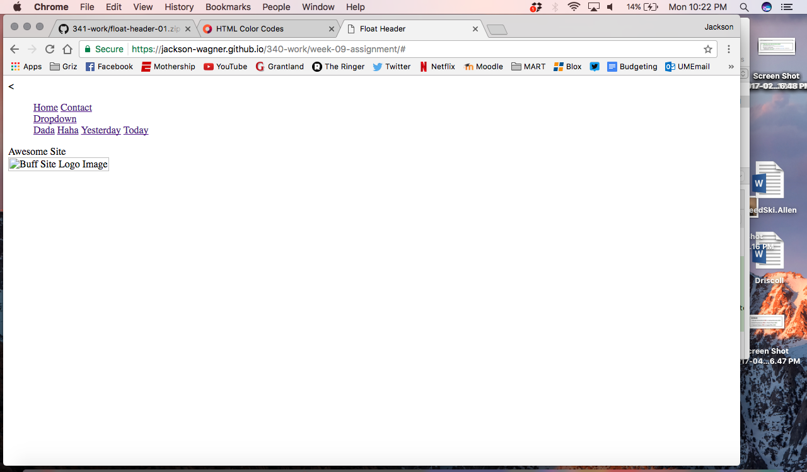

# Week 09 Assignment

## Jackson Wagner

Well this is shaping up to be another strange week for me. After I messed with the code for hours last week and couldn't get the CSS to link, it worked on my first try this week. Unfortunately, it didn't seem like any of the changes I made were having any effect on my website. I had my whole header built, and thought my code looked right, but nothing was showing up on the website. In frustration, I went to the example from the reading this week that Michael made and copy and pasted it to see if that would show me anything. Unfortunately, it didn't. I'm not sure if I have something on my computer that is causing this to happen or what, but by the time you read this I will probably have set up a time with you through email to meet. For now, I'm going to keep trying things I guess and at least get a solid css and html page setup in my best attempt to get this site going.

